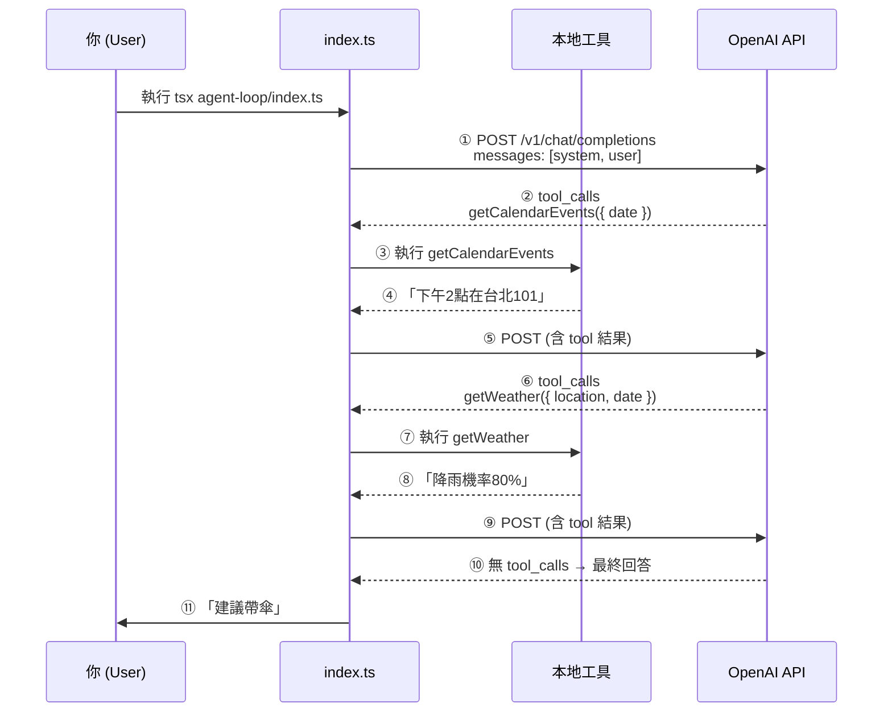
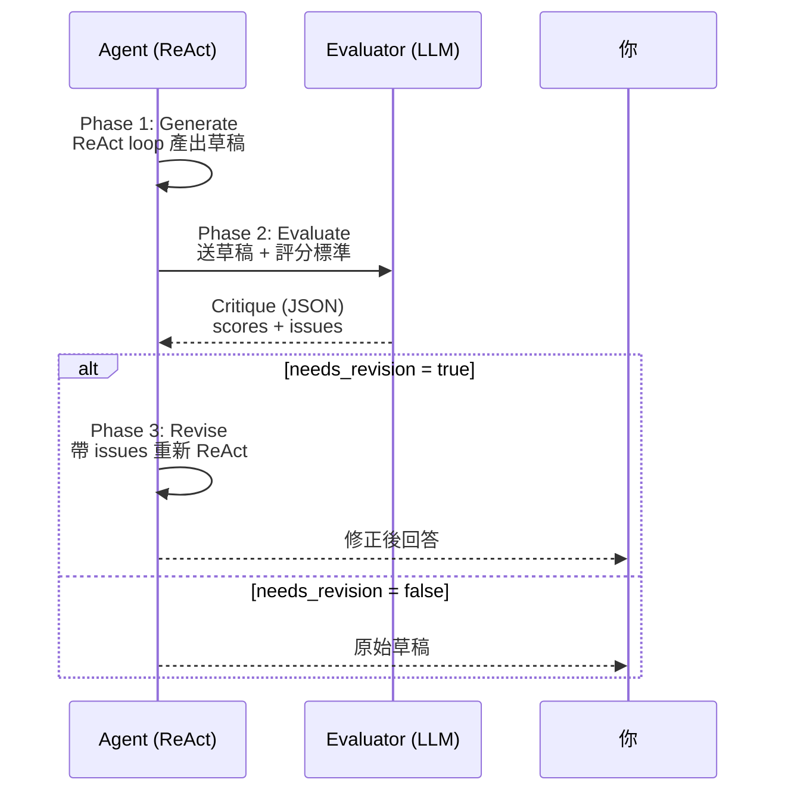
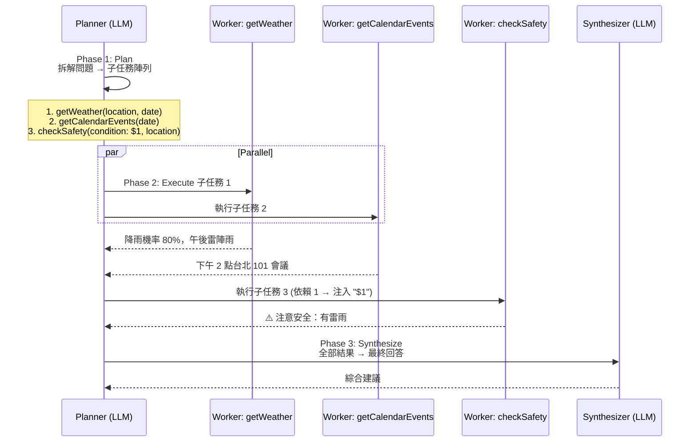

# Agent 思考迴圈 (ReAct Loop)

## 檔案

| 檔案 | 說明 |
|---|---|
| `loop.ts` / `index.ts` | 基本 ReAct 迴圈 — LLM 決定何時 call tool、何時回答 |
| `evaluator-optimizer.ts` / `evaluator-index.ts` | Evaluator-Optimizer 模式 — ReAct 產出草稿後，由獨立評審 LLM 檢查品質，需要時修正 |
| `orchestrator-worker.ts` / `orchestrator-index.ts` | Orchestrator-Worker 模式 — 中央 LLM 動態拆解任務、委派給 worker、合成結果 |

## 基本 ReAct 流程



## Evaluator-Optimizer 流程



## Orchestrator-Worker 流程



## 執行

```bash
# 基本 ReAct
tsx agent-loop/index.ts

# Evaluator-Optimizer
tsx agent-loop/evaluator-index.ts

# Orchestrator-Worker
tsx agent-loop/orchestrator-index.ts
```
