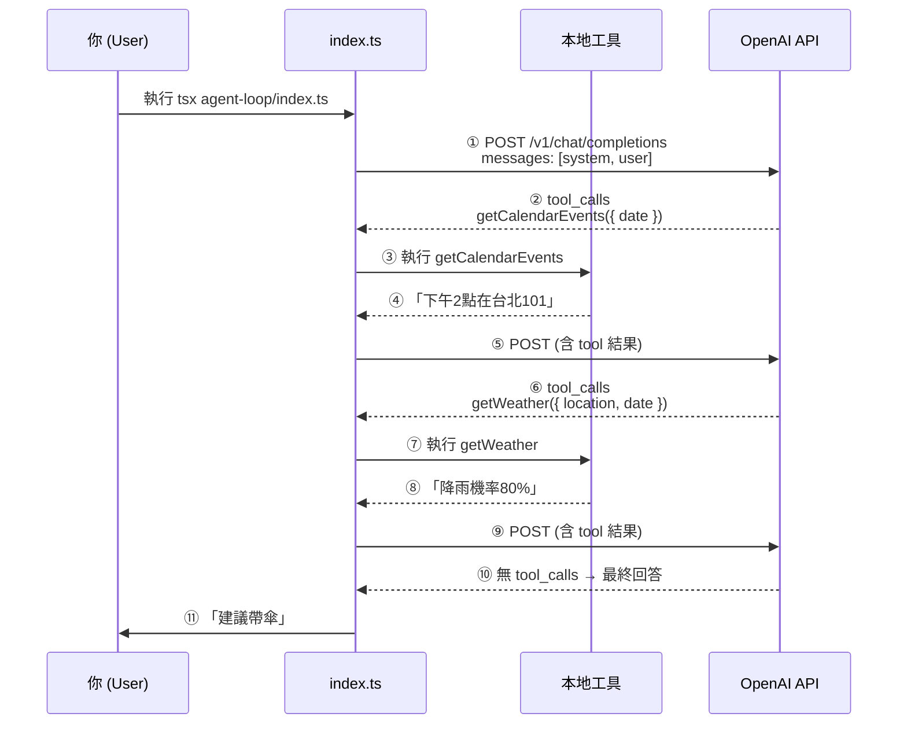

# Agent 思考迴圈 (ReAct Loop)

## 流程


```mermaid
sequenceDiagram
    participant User as 你 (User)
    participant Agent as index.ts
    participant Tools as 本地工具
    participant LLM as OpenAI API

    User->>Agent: 執行 tsx agent-loop/index.ts
    Agent->>LLM: ① POST /v1/chat/completions<br/>messages: [system, user]
    LLM-->>Agent: ② tool_calls<br/>getCalendarEvents({ date })
    Agent->>Tools: ③ 執行 getCalendarEvents
    Tools-->>Agent: ④ 「下午2點在台北101」
    Agent->>LLM: ⑤ POST (含 tool 結果)
    LLM-->>Agent: ⑥ tool_calls<br/>getWeather({ location, date })
    Agent->>Tools: ⑦ 執行 getWeather
    Tools-->>Agent: ⑧ 「降雨機率80%」
    Agent->>LLM: ⑨ POST (含 tool 結果)
    LLM-->>Agent: ⑩ 無 tool_calls → 最終回答
    Agent->>User: ⑪ 「建議帶傘」
```

## 執行

```bash
tsx agent-loop/index.ts
```
