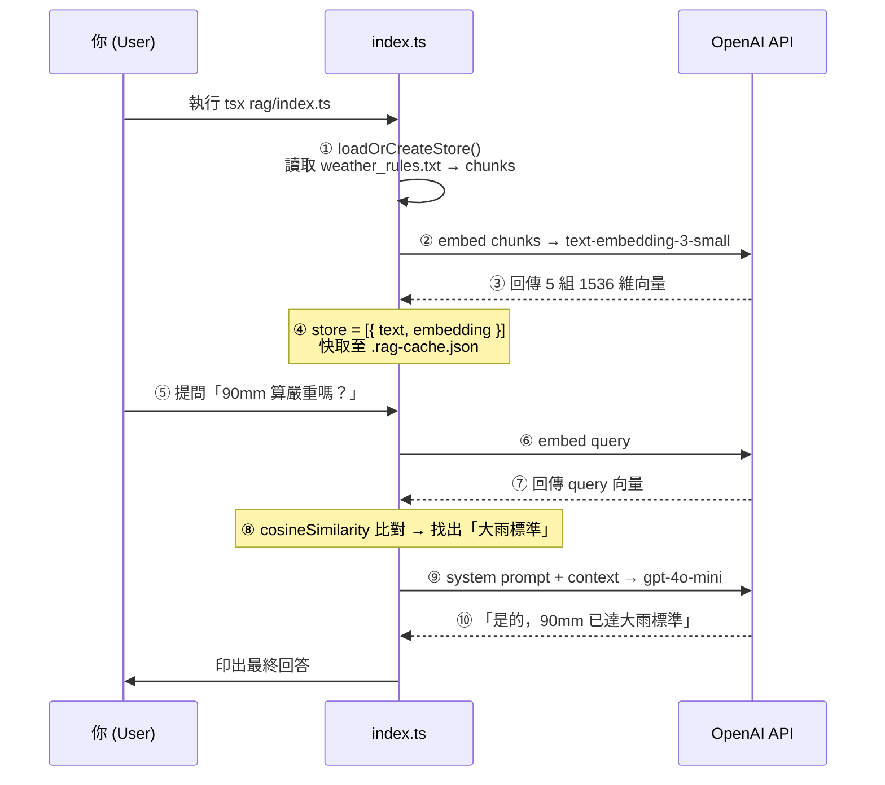

# RAG — Retrieval-Augmented Generation Hello World

## 流程


```mermaid
sequenceDiagram
    participant User as 你 (User)
    participant Client as index.ts
    participant API as OpenAI API

    User->>Client: 執行 tsx rag/index.ts
    Client->>Client: ① loadOrCreateStore()<br/>讀取 weather_rules.txt → chunks
    Client->>API: ② embed chunks → text-embedding-3-small
    API-->>Client: ③ 回傳 5 組 1536 維向量
    Note over Client: ④ store = [{ text, embedding }]<br/>快取至 .rag-cache.json
    User->>Client: ⑤ 提問「90mm 算嚴重嗎？」
    Client->>API: ⑥ embed query
    API-->>Client: ⑦ 回傳 query 向量
    Note over Client: ⑧ cosineSimilarity 比對 → 找出「大雨標準」
    Client->>API: ⑨ system prompt + context → gpt-4o-mini
    API-->>Client: ⑩ 「是的，90mm 已達大雨標準」
    Client->>User: 印出最終回答
```

## 執行

```bash
tsx rag/index.ts
```

首次執行會呼叫 Embedding API 並快取至 `.rag-cache.json`，之後直接讀取快取。
