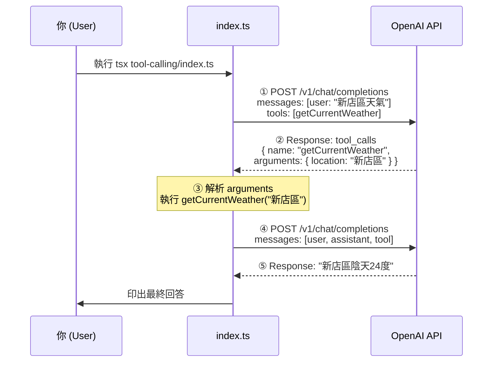

# Tool Calling — OpenAI Function Calling Hello World

## 流程



## 角色 (role)

| role | 意義 |
|---|---|
| `system` / `developer` | 設定 AI 行為的系統指令 |
| `user` | 使用者的輸入 |
| `assistant` | 模型的回覆（文字或 `tool_calls`） |
| `tool` | 本地執行工具後的結果 |

## 執行

```bash
tsx tool-calling/index.ts
```
